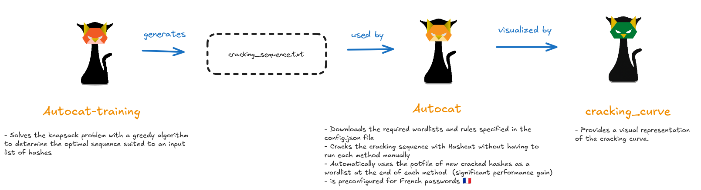

# Password Cracking Progress Visualization

A real-time visualization tool for monitoring Hashcat / [Autocat](https://github.com/k4amos/Autocat) password cracking progress with interactive curves.

Exemple of two cracking curves from this 2014 [public leak](https://github.com/YoureIronic/Historical-Data-Breaches-Archive/blob/main/breaches/Dominos/index.md) :
<p align="center">

</p>

## Basic Usage

When you run Hashcat, you must add the following argument : `--status-json --status-timer 1 --status | tee save_output`. This allows you to save the logs of your cracking process (one log per second) in an easily parsable format to the file of your choice, in the example `save_output`.

```bash
hashcat [options] --status-json --status-timer 1 --status | tee save_output
```

You can then (during or after cracking) run the following command to visualize the generated cracking curve:

```bash
# Single file
python password_cracking_curve.py save_output
```

You can visualize multiple cracking curves (from different files) simultaneously to compare them :

```bash
# Multiple files
python password_cracking_curve.py save_output_1 save_output_2 save_output_3

# All files in directory
python password_cracking_curve.py *
```

It also works with [Autocat](https://github.com/k4amos/Autocat) which allows you to easily create cracking sequences and automatically uses the potfile as a wordlist, as you can see in the image above.

## Requirements

- Python 3.6+
- Dash
- Plotly
- Hashcat (for generating input data)

## Installation

```bash
pip install dash plotly
```

### Command Line Arguments


| Argument | Description | Default |
|----------|-------------|---------|
| `files` | Path(s) to hashcat JSON output file(s) (required) | - |
| `--host` | Server host address | 127.0.0.1 |
| `--port` | Server port | 8050 |
| `-h, --help` | Show help message | - |

## Other Tools

- [Autocat-training](https://github.com/k4amos/Autocat-training) : Autocat-training aims to solve the **knapsack problem** using a **greedy algorithm** to determine the **most optimal password cracking sequence** for cracking a given input list of hashes and a list of cracking methods (wordlists, rules, brute-force) that you can specify.
- [Autocat](https://github.com/k4amos/Autocat) : This tool makes it easy to run a cracking sequence with Hashcat without launching each method 'by hand'. Moreover, at the end of each method, the new passwords recovered in plaintext in the potfile are used as a wordlist together with a rule, which significantly improves cracking performance. This tool is pre-configured to crack French passwords: a large benchmark was run with Autocat‑training with a significant number of French hashes from various sources, which were cracked using a GPU. The sequence obtained is Autocat's default, but it is possible to define a custom sequence for other languages.

<div align="center">
    
</div>

## Disclaimer

> [!CAUTION]
> This tool is provided for educational and authorized security testing purposes only. Users are responsible for complying with all applicable laws and regulations. The authors assume no liability for misuse or damage caused by this tool.