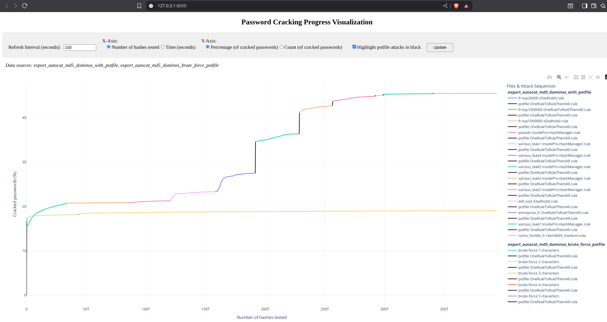

# Password Cracking Progress Visualization

A real-time visualization tool for monitoring Hashcat / [Autocat](https://github.com/k4amos/Autocat) password cracking progress with interactive curves.

Exemple of a sequence cracking curve from this 2014 [public leak](https://github.com/YoureIronic/Historical-Data-Breaches-Archive/blob/main/breaches/Dominos/index.md) :
<p align="center">

</p>

## Basic Usage

When you run Hashcat, you must add the following argument : `--status-json --status-timer 1 --status | tee save_output.json`. This allows you to save the logs of your cracking process (one log per second) in an easily parsable format to the file of your choice, in the example `save_output.json`.

```bash
hashcat [options] --status-json --status-timer 1 --status | tee save_output.json
```

You can then (during or after cracking) run the following command to visualize the generated cracking curve:

```bash
# Single file
python password_cracking_curve.py output.json
```

You can visualize multiple cracking curves (from different files) simultaneously to compare them :

```bash
# Multiple files
python password_cracking_curve.py output1.json output2.json output3.json

# All JSON files in directory
python password_cracking_curve.py *.json
```

It also works with [Autocat](https://github.com/k4amos/Autocat) which allows you to easily create cracking sequences and automatically uses the potfile as a wordlist, as you can see in the image above.

## Requirements

- Python 3.6+
- Dash
- Plotly
- Hashcat (for generating input data)

## Installation

```bash
pip install dash plotly
```

### Command Line Arguments


| Argument | Description | Default |
|----------|-------------|---------|
| `files` | Path(s) to hashcat JSON output file(s) (required) | - |
| `--host` | Server host address | 127.0.0.1 |
| `--port` | Server port | 8050 |
| `-h, --help` | Show help message | - |

## License

This tool is provided as-is for security analysis and defensive purposes only.